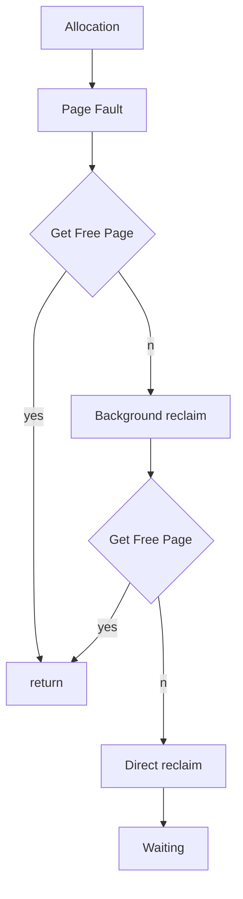
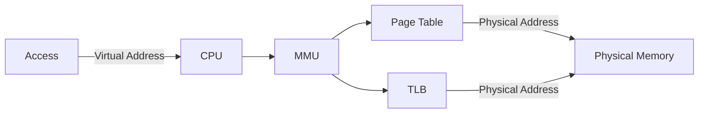

<!-- toc -->

本文主要从操作系统层面对使用中内存层面的排查方法及典型问题进行介绍。

# 1 相关概念

## 1.1 内存是什么


这张图相信还是有不少人见过，它展示了电脑中不同层级的存储装置的特点。通常，技术人员对于寄存器、缓存、内存、SSD、HDD的区别还是有所了解，内存位于第三层，速度慢于缓存而快于SSD，容量大于缓存而小于SSD，成本低于缓存而高于SSD。

内存主要解决什么问题？这依赖于通常意义下内存的容量与速度能解决什么问题，以及应该去解决什么问题。各个存储装置的容量可能各位技术人员都有所了解，但是速度具体是什么样子并不一定清晰。下面以三代I7(主频3.4GHz)为例让大家对速度有一个大致的概念。

| 类型     | 容量  | 速度                     |
| -------- | ----- | ------------------------ |
| Register | ~2KB  | 4 cycles (~1.2ns)        |
| L1 Cache | 32KB  | 4 cycles (~1.2ns)        |
| L2 Cache | 256KB | 12 cycles (~3.5ns)       |
| L3 Cache | 8MB   | 29 ~ 35 cycles (~10ns)   |
| Memory   | ~GB   | 30 cycles + 53ns (~62ns) |

到这里并没有结束，应用代码建立在操作系统之上，以Linux为例，在不修改内核代码的前提下，用户态代码访问的都是逻辑地址(VA)，而非物理地址(PA)。

VA到PA的映射以页(Page)为单位，维护映射关系的称之为页表，页表一般很大并且放在内存中。具体如何管理映射不是本文重点，这里暂且到引出Page为止。

## 1.2 内存问题的范畴

内存的使用既包括应用对内存的直接使用(当然也是通过VA)，也包括操作系统利用内存对磁盘做的缓冲区。通过/proc/meminfo可以看到上述操作涉及到的所有内存区域的信息

```
[root@terrell ~]# cat /proc/meminfo
MemTotal:        1870836 kB
MemFree:         1521984 kB
MemAvailable:    1589244 kB
Buffers:            2104 kB
Cached:           182428 kB
SwapCached:            0 kB
Active:           129244 kB
Inactive:         120276 kB
Active(anon):      65180 kB
Inactive(anon):     1800 kB
Active(file):      64064 kB
Inactive(file):   118476 kB
Unevictable:           0 kB
Mlocked:               0 kB
SwapTotal:             0 kB
SwapFree:              0 kB
Dirty:               412 kB
Writeback:             0 kB
AnonPages:         65012 kB
Mapped:            99476 kB
Shmem:              1992 kB
KReclaimable:      31452 kB
Slab:              57524 kB
SReclaimable:      31452 kB
SUnreclaim:        26072 kB
KernelStack:        2172 kB
PageTables:         6448 kB
NFS_Unstable:          0 kB
Bounce:                0 kB
WritebackTmp:          0 kB
CommitLimit:      935416 kB
Committed_AS:     317048 kB
VmallocTotal:   34359738367 kB
VmallocUsed:           0 kB
VmallocChunk:          0 kB
Percpu:              412 kB
HardwareCorrupted:     0 kB
AnonHugePages:     10240 kB
ShmemHugePages:        0 kB
ShmemPmdMapped:        0 kB
HugePages_Total:       0
HugePages_Free:        0
HugePages_Rsvd:        0
HugePages_Surp:        0
Hugepagesize:       2048 kB
Hugetlb:               0 kB
DirectMap4k:       87936 kB
DirectMap2M:     2009088 kB
DirectMap1G:           0 kB
```

# 2 PageCache

这里存在一个等式：Buffer(2104) + Cached(182428) +SwapCached(0) = Active(file)(64064) + Inactive(file)(118476) + Shmem(1992) + SwapCached(0)，等式两边都是Page Cache。

Active(file)、Inactive(file)与Shmem是对Buffer和Cache的细分，其中主要关注Active(file)与Inactive(file)，mmap或buffered IO方式使用的内存即是这部分，主要用于磁盘IO加速。具体PageCache的管理由内存负责。

## 2.1 PageCache的生命周期

PageCache的产生由mmap或bufferedIO导致，对文件的读写会转化为对内存的操作，从而提高性能；被修改过的Page被称为脏页；PageCache的回收由内核负责进行，将修改过的内容写到低速存储设备后腾出空间。

通过sar命令可以很好的观察PageCache的吞吐量：

```
[root@terrell ~]# sar -B 1
Linux 4.18.0-193.28.1.el8_2.x86_64 (terrell) 	2020年12月13日 	_x86_64_	(1 CPU)

16时03分58秒  pgpgin/s pgpgout/s   fault/s  majflt/s  pgfree/s pgscank/s pgscand/s pgsteal/s    %vmeff
16时03分59秒      0.00      0.00      0.00      0.00      0.00      0.00      0.00      0.00      0.00
16时04分00秒      0.00      0.00      0.00      0.00      0.00      0.00      0.00      0.00      0.00
16时04分01秒      0.00      0.00      0.00      0.00     56.00      0.00      0.00      0.00      0.00
16时04分02秒      0.00      0.00      0.00      0.00     18.00      0.00      0.00      0.00      0.00

```

## 2.2 PageCache的典型问题

PageCache的大小由内存可用空间决定，是一种有限资源，就免不了回收。PageCache的问题往往与回收有关，PageCache的回收分为两种，直接回收和后台回收。后台回收由系统负责，直接回收往往发生在应用申请内存时。

应用申请内存时，如果内存不足，则触发缺页中断，并最终可能导致直接回收PageCache，这是应用会犹豫直接回收的操作阻塞在这里。简要的流程图描述如下



导致后台回收完成度较低的原因包括：

- 后台任务参数配置存在问题，未能尽力执行
- 吞吐量过大以致低速存储设备无法承载

其中，吞吐量过大指的产生的脏页太多，低速存储设备马力全开也无法容纳。而影响后台任务执行的核心参数包括：

- dirty_writeback_centisecs：脏页检查启动间隔
- dirty_background_ratio：当脏页超过某个百分比时触发后台回收
- dirty_expire_centisecs：脏页被标记多久会被回收
- v m.min_free_kbytes：回收水位，保留至少多少可用内存

## 2.3 PageCache问题的定位

定位可以分成两方面：

- 是不是PageCache的问题
- PageCache问题产生的原因

### 2.3.1 如何判断是否是PageCache相关的问题

判断是否是PageCache的问题依赖与PageCache相关的指标，常见指标如下：

| /proc/vmstat指标   | 指标具体解释                             | 问题点        |
| ------------------ | ---------------------------------------- | ------------- |
| pgscan_kswapd      | kswapd后台扫描的Page个数                 | PageCache回收 |
| pagesteal_kswapd   | kswapd后台回收的Page个数                 | 同上          |
| pgscan_direct      | 进程直接扫描的Page个数                   | 同上          |
| pagesteal_direct   | 进程直接回收的Page个数                   | 同上          |
| compact_stall      | 直接碎片整理的次数                       | 碎片整理      |
| compact_fail       | 直接碎片整理失败的次数                   | 同上          |
| compact_success    | 直接碎片整理成功的次数                   | 同上          |
| nr_dirty           | 脏页个数                                 | 脏页写回      |
| drop_pagecache     | 执行drop_cache来drop PageCache的次数     | drop cache    |
| drop_slab          | 执行drop_cache来drop slab的次数          | 同上          |
| pginodesteal       | 直接回收inode过程中回收的PageCache个数   | 同上          |
| kswapd_inodesteal  | kswapd后台回收inode过程中回收的Page个数  | 同上          |
| pgpgin             | 从磁盘读文件读了多少Page到内存           | I/O           |
| pgpgout            | 内存中多少Page被写回磁盘                 | 同上          |
| pswpin             | 从swap分区读了多少Page到内存             | SWAP I/O      |
| pswpout            | 内存中多少Page被交换到swap分区           | 同上          |
| workingset_refault | Page被释放后短时间内再次被从磁盘读到内存 | workingset    |
| workingset_restore | Page被回收前又被检测为活跃Page而避免回收 | 同上          |

### 2.3.2 定位PageCache问题产生的原因

前面提到最典型的问题是回收问题，下面主要介绍回收类型问题定位的两个关键点：

- 进程是否因为回收被阻塞
- 低速存储设备吞吐量是否跟不上

**定位进程阻塞**

一种方式，通过CPU火焰图，能够分析出哪些方法占用CPU时间较多，以及花在什么上面。Java进程的火焰图可以通过Arthus进行采集，其他通用的方式也包括使用perf等Linux诊断工具。相关资料网上非常丰富。

另一种方式，类似于火焰图，可以直接对耗时较久的调用栈进行捕捉，参考[RocketMQ DLedger毛刺排查](https://www.yuque.com/chentairan-klqff/wnx49g/gggt00)中bcc工具的使用。

**定位速度瓶颈**

通过**iostat -x 1**命令可以获得磁盘IO的饱和度，通过前面提到的**sar -B 1**命令可以获得PageCache的吞吐量信息，两者对比即可分析出瓶颈所在。

## 2.4 PageCache回收问题的主要解决策略

针对不同的问题原因，解决策略也不尽相同，下面简单介绍下主要的几个思路。

### 2.4.1 进程阻塞的解决思路 

- 提前触发后台回收
- 确保最低的内存空余空间
- 代码中提前申请内存并预热

### 2.4.2 存储设备速度太低的解决思路

- 更换速度更快的硬件设备
- 代码中主动控制缓存部分更底层的逻辑，限制缓存大小/修改IO方式/减小修改量

# 3 内存

## 3.1 内存分配过程

前面有提到存在VA与PA的对应关系，即页表。页表是一个多层的数据结构，这里暂且不做介绍。整个内存分配过程大致如下图：



操作系统返回给用户的地址均是VA，用户访问内存也是通过VA。CPU通过MMU来查询对应关系并访问物理内存，其中TLB可以理解为是对PageTable的缓存。这方面网上详细内容很多，不是本文的重点。


## 3.2 内存泄露

内存泄漏指分配出去的内存一直没有被释放，而导致可用空间越来越少，描述的是一种现象。随着程序运行，系统可用内存一直减少，也就是内存泄漏，最终将会触发系统OOM Killer采取性能。

### 3.2.1 内存泄漏的发现

- 通过系统日志发现
  - 当发生OOM kill，系统的/var/log/messages会有相应日志记录
- 通过系统内存监控发现
  - free、top等命令均能发现系统内存持续减小的情况

当发现系统内存不足，或可用内存持续下降时，就应该尝试对原因进行定位。

### 3.2.2 内存泄漏的定位

首先需要强调，所有的问题均需要落到排查应用代码（或调用栈）来切实发现具体问题，排查内存的方式都是辅助。

#### 3.2.2.1 排查占用内存最大的进程

通过top命令的内存模式，可以方便找出占用内存最多的进程

```
# top命令中键入g再键入3进入内存模式
top - 17:20:38 up  5:23,  4 users,  load average: 0.02, 0.03, 0.00
Tasks: 103 total,   2 running, 101 sleeping,   0 stopped,   0 zombie
%Cpu(s):  1.7 us,  1.3 sy,  0.0 ni, 96.0 id,  0.0 wa,  1.0 hi,  0.0 si,  0.0 st
MiB Mem :   1827.0 total,    102.9 free,   1510.8 used,    213.3 buff/cache
MiB Swap:      0.0 total,      0.0 free,      0.0 used.    171.3 avail Mem

    PID  %MEM    VIRT    RES   CODE    DATA    SHR nMaj nDRT  %CPU COMMAND
   4133  65.9 5663400   1.2g      4 1332360  16672    6    0   1.7 java
   3732   9.4 2296680 176276      4  450576  16036    1    0   0.3 java
    892   1.3  425268  24568      8   39412   9780   39    0   0.0 tuned
    728   0.9 1607700  16332    104   54864  11420   91    0   0.0 polkitd
```

| 指标 | 含义                 |
| ---- | -------------------- |
| VIRT | 虚拟内存大小         |
| RES  | 实际物理内存大小     |
| CODE | 代码段大小           |
| DATA | 数据段大小           |
| SHR  | 共享内存区域         |
| nMaj | 主缺页中断           |
| nDRT | linux内核2.6之后废弃 |


#### 3.2.2.2 观察进程的内存使用

观察进程对内存的使用主要包括两个方面：

- 绝对的：内存具体用在哪里
- 相对的：内存申请速度与释放速度对比

**观察内存具体用在哪里，可通过pmap命令：**

```
[root@iZbp15b98qdph887ywie5qZ rocketmqlogs]# pmap -x 4133
4133:   /bin/java -server -Xms1g -Xmx1g -Xmn500m -XX:+UseG1GC -XX:G1HeapRegionSize=16m -XX:G1ReservePercent=25 -XX:InitiatingHeapOccupancyPercent=30 -XX:SoftRefLRUPolicyMSPerMB=0 -verbose:gc -Xloggc:/dev/shm/rmq_broker_gc_%p_%t.log -XX:+PrintGCDetails -XX:+PrintGCDateStamps -XX:+PrintGCApplicationStoppedTime -XX:+PrintAdaptiveSizePolicy -XX:+UseGCLogFileRotation -XX:NumberOfGCLogFiles=5 -XX:GCLogFileSize=30m -XX:-OmitStackTraceInFastThrow -XX:+AlwaysPreTouch -XX:MaxDirectMemorySize=1g -XX:-UseLargePages -XX:-UseBi
Address           Kbytes     RSS   Dirty Mode  Mapping
00000000c0000000 1050880 1050880 1050880 rw---   [ anon ]
0000000100240000 1046272       0       0 -----   [ anon ]
0000555f97c44000       4       4       0 r-x-- java
0000555f97e44000       4       4       4 r---- java
0000555f97e45000       4       4       4 rw--- java
0000555f990fd000     264     132     132 rw---   [ anon ]
00007f45cb3e7000      12       0       0 -----   [ anon ]
00007f45cb3ea000    1016      96      96 rw---   [ anon ]
00007f45cb4e8000      12       0       0 -----   [ anon ]
00007f45cb4eb000    2296    1372    1372 rw---   [ anon ]
00007f45cb729000     768       0       0 -----   [ anon ]
00007f45cb7e9000      12       0       0 -----   [ anon ]
00007f45cb7ec000    1016      92      92 rw---   [ anon ]
00007f45cb8ea000  410160       4       0 rw-s- 20201220144406326
00007f45e4976000    5860       0       0 rw-s- 00000000000000000000
00007f45e4f2f000 1048576       0       0 rw-s- 00000000001073741824
00007f4624f2f000 1048576       0       0 rw-s- 00000000000000000000
00007f4664f2f000      12       0       0 -----   [ anon ]
```

| 指标    | 含义                 |
| ------- | -------------------- |
| Address | 虚拟空间起始地址     |
| Kbytes  | 虚拟内存大小         |
| RSS     | 映射的物理内存的大小 |
| Dirty   | 脏页大小             |
| Mode    | 内存权限             |
| Mapping | 映射的文件，或堆栈等 |

观察内存具体用在哪里，也可以通过/proc/pid/smaps查看：

```
c0000000-100240000 rw-p 00000000 00:00 0
Size:            1050880 kB
KernelPageSize:        4 kB
MMUPageSize:           4 kB
Rss:             1050880 kB
Pss:             1050880 kB
Shared_Clean:          0 kB
Shared_Dirty:          0 kB
Private_Clean:         0 kB
Private_Dirty:   1050880 kB
Referenced:      1050880 kB
Anonymous:       1050880 kB
LazyFree:              0 kB
AnonHugePages:   1050624 kB
ShmemPmdMapped:        0 kB
Shared_Hugetlb:        0 kB
Private_Hugetlb:       0 kB
Swap:                  0 kB
SwapPss:               0 kB
Locked:                0 kB
VmFlags: rd wr mr mw me ac sd
100240000-140000000 ---p 00000000 00:00 0
Size:            1046272 kB
KernelPageSize:        4 kB
MMUPageSize:           4 kB
Rss:                   0 kB
Pss:                   0 kB
Shared_Clean:          0 kB
Shared_Dirty:          0 kB
Private_Clean:         0 kB
Private_Dirty:         0 kB
Referenced:            0 kB
Anonymous:             0 kB
LazyFree:              0 kB
AnonHugePages:         0 kB
ShmemPmdMapped:        0 kB
Shared_Hugetlb:        0 kB
Private_Hugetlb:       0 kB
Swap:                  0 kB
SwapPss:               0 kB
Locked:                0 kB
VmFlags: mr mw me nr sd
...........................
```

**观察内存申请速度与释放速度，可以通过pidstat命令：**

```
[root@iZbp15b98qdph887ywie5qZ rocketmqlogs]# pidstat -r -p 4133 1
Linux 4.18.0-193.28.1.el8_2.x86_64 (iZbp15b98qdph887ywie5qZ) 	2020年12月20日 	_x86_64_	(1 CPU)

17时49分52秒   UID       PID  minflt/s  majflt/s     VSZ     RSS   %MEM  Command
17时49分53秒     0      4133      0.00      0.00 5663400 1232968  65.90  java
17时49分54秒     0      4133      0.00      0.00 5663400 1232968  65.90  java
17时49分55秒     0      4133      0.00      0.00 5663400 1232968  65.90  java
17时49分56秒     0      4133      0.00      0.00 5663400 1232968  65.90  java
17时49分57秒     0      4133      1.00      0.00 5663400 1232968  65.90  java
17时49分58秒     0      4133      1.00      0.00 5663400 1232968  65.90  java
17时49分59秒     0      4133      0.00      0.00 5663400 1232968  65.90  java
17时50分00秒     0      4133      0.00      0.00 5663400 1232968  65.90  java
```

| 指标     | 含义               |
| -------- | ------------------ |
| majflt/s | 主缺页中断发生次数 |
| minflt/s | 次缺页中断发生次数 |

前面介绍过的指标不再占用篇幅，这里主要有两个新指标。通过对比每个时间点占用内存的大小，可以发现进程的内存使用趋势。

**观察内存申请与释放，也可以通过strace来跟踪：**

```
[root@iZbp15b98qdph887ywie5qZ rocketmqlogs]# strace -t -f -p 4133 -o 4133.strace
[root@iZbp15b98qdph887ywie5qZ rocketmqlogs]# grep mmap -A3 4133.strace |head -10
4175  17:59:21 mmap(NULL, 1052672, PROT_READ|PROT_WRITE, MAP_PRIVATE|MAP_ANONYMOUS|MAP_STACK, -1, 0) = 0x7f45cb2e6000
4175  17:59:21 clone( <unfinished ...>
4165  17:59:21 <... futex resumed>)     = -1 ETIMEDOUT (连接超时)
4165  17:59:21 futex(0x7f469c89c428, FUTEX_WAKE_PRIVATE, 1) = 0
--
4822  17:59:21 mmap(0x7f45cb2e6000, 12288, PROT_READ|PROT_WRITE, MAP_PRIVATE|MAP_FIXED|MAP_ANONYMOUS, -1, 0) = 0x7f45cb2e6000
4822  17:59:21 mprotect(0x7f45cb2e6000, 12288, PROT_NONE) = 0
4822  17:59:21 prctl(PR_SET_NAME, "NettyServerNIOS"...) = 0
4822  17:59:21 epoll_wait(75, [{EPOLLIN, {u32=73, u64=73}}], 8192, 0) = 1
--
```

跟踪4133进程的部分日志，可以看到4133进程申请了两次，一次是创建线程，一次是NettyServerNIOSelector_申请了一段空间。

#### 3.2.2.3 汇总分析

上述的信息只透露出哪里可能出现了问题，但并不能直接定位到代码中的问题点。还需要依赖上述信息，对代码进行分析，同时也可以对内存空间进行进一步分析。如Java可以dumpJVM堆到本地进行分析，可以较便捷的识别出泄漏的具体对象，更易于进行代码分析。

# 4 内存问题总结

- 问题类型：
  - PageCache：回收
  - 内存：泄漏
- 问题原因：
  - PageCache：
    - 包括回收策略不科学、回收性能跟不上
  - 内存：
    - 代码问题
    - 内核也可能有问题
- 定位手段：
  - /proc/meminfo
  - /proc/vmstat
  - PageCache
    - sar
    - perf
    - iostat
  - 内存
    - top
    - pmap
    - /proc/pid/smaps
    - pidstat
    - strace
    - 结合代码

# 参考文献

邵亚方《极客时间》上的《Linux内核技术实战课》系列

