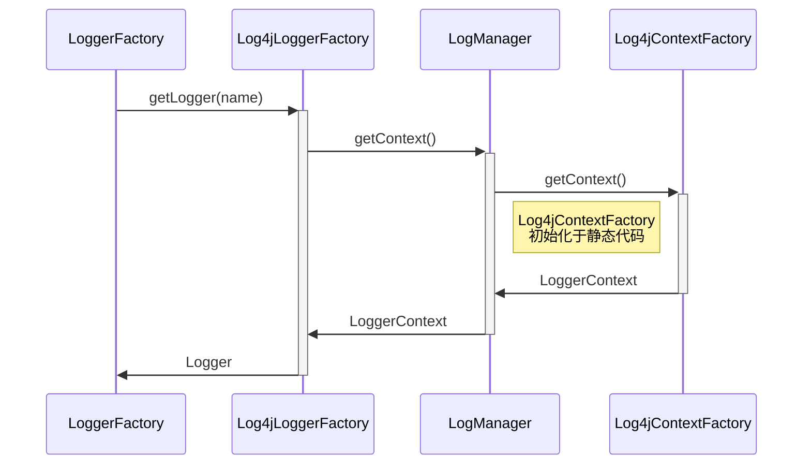
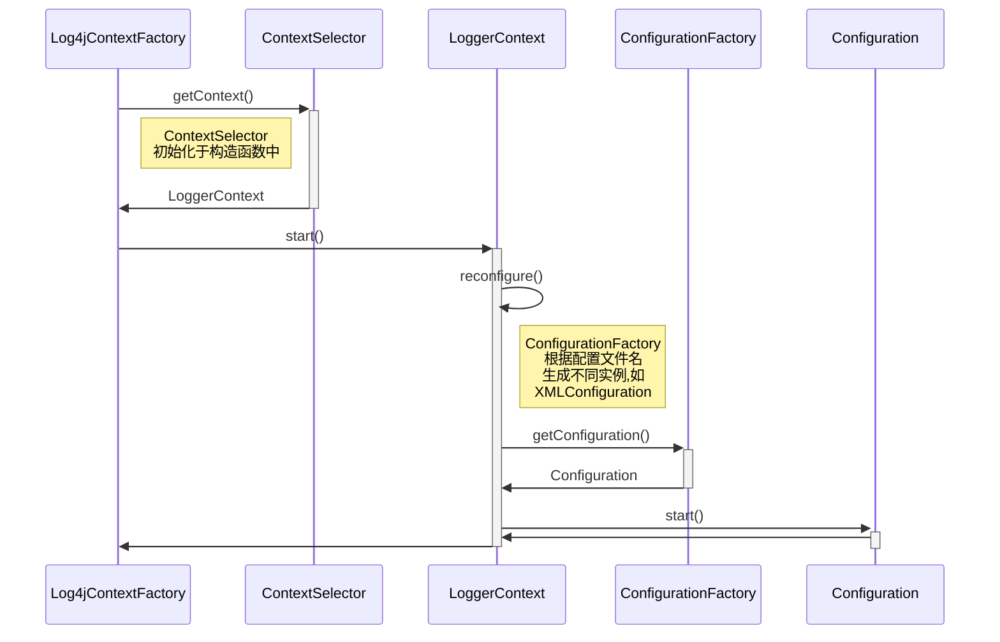
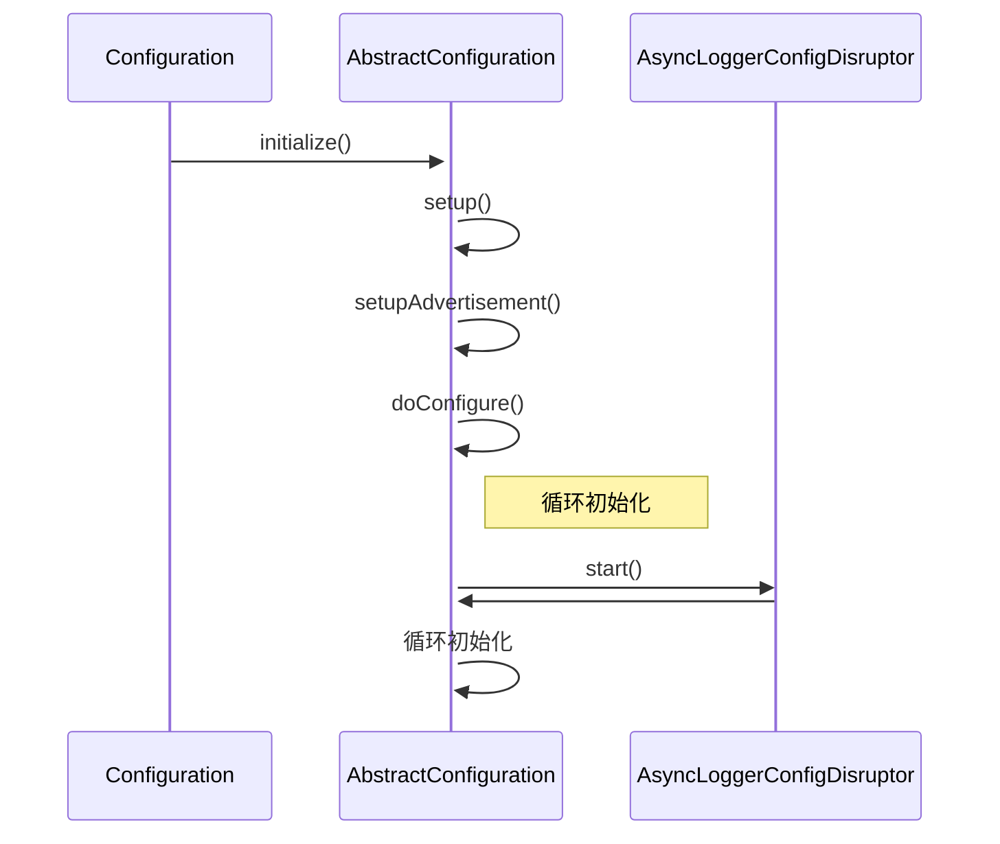

<!-- toc -->

## 4 Log4j 2加载流程

Log4j2包名为org.apache.logging.log4j:log4j，与SLF4J整合使用需要引入其log4j-slf4j-impl模块。下面继续从StaticLoggerBinder开始分析

### 4.1 LoggerContext的创建

```java
public final class StaticLoggerBinder implements LoggerFactoryBinder {

  public static String REQUESTED_API_VERSION = "1.6"; // !final
  private static final String LOGGER_FACTORY_CLASS_STR = Log4jLoggerFactory.class.getName();
  private static final StaticLoggerBinder SINGLETON = new StaticLoggerBinder();
  private final ILoggerFactory loggerFactory;

  private StaticLoggerBinder() {
    loggerFactory = new Log4jLoggerFactory();
  }

  public static StaticLoggerBinder getSingleton() {
    return SINGLETON;
  }

  @Override
  public ILoggerFactory getLoggerFactory() {
    return loggerFactory;
  }

  @Override
  public String getLoggerFactoryClassStr() {
    return LOGGER_FACTORY_CLASS_STR;
  }
}
```

在StaticLoggerBinder初始化过程中创建了一个Log4jLoggerFactory实例。

```java
public class Log4jLoggerFactory extends AbstractLoggerAdapter<Logger> implements ILoggerFactory {

  private static final String FQCN = Log4jLoggerFactory.class.getName();
  private static final String PACKAGE = "org.slf4j";
  private static final String TO_SLF4J_CONTEXT = "org.apache.logging.slf4j.SLF4JLoggerContext";
.......
  @Override
  protected LoggerContext getContext() {
    final Class<?> anchor = StackLocatorUtil.getCallerClass(FQCN, PACKAGE);
    return anchor == null ? LogManager.getContext() : getContext(StackLocatorUtil.getCallerClass(anchor));
  }
.......
}
```

在Log4jLoggerFactory及其父类AbstractLoggerAdapter中并没有静态方法可以被触发，但在父类中实现了getLogger(name)方法。

还记得上文2.3部分的图一中有展示，整个在getILoggerFactory后会调用ILoggerFactory的getLogger方法。可以确认，log4j2的初始化流程从这里展开。

```java
public L getLogger(final String name) {
  // 获取context，调用的就是上面贴出代码的getContext()方法
  final LoggerContext context = getContext();
  final ConcurrentMap<String, L> loggers = getLoggersInContext(context);
  final L logger = loggers.get(name);
  if (logger != null) {
    return logger;
  }
  loggers.putIfAbsent(name, newLogger(name, context));
  return loggers.get(name);
}

```

在getContext()中首次出现了LogManager的身影，查看LogManager.getContext()方法

```java
public static LoggerContext getContext() {
  try {
    return factory.getContext(FQCN, null, null, true);
  } catch (final IllegalStateException ex) {
    LOGGER.warn(ex.getMessage() + " Using SimpleLogger");
    return new SimpleLoggerContextFactory().getContext(FQCN, null, null, true);
  }
}
```

这里的factory在LogManager的静态代码中初始化，简单介绍逻辑为从log4j-core的配置文件中获取factory的FQCN，通过反射创建对应实例。默认模式下，factory为org.apache.logging.log4j.core.impl.Log4jContextFactory。

```java
// org.apache.logging.log4j.core.impl.Log4jContextFactory 的 getContext方法
public LoggerContext getContext(final String fqcn, final ClassLoader loader, final Object externalContext,
                                final boolean currentContext) {
  // selector 在反射创建 Log4jContextFactory 的过程中，被无参构造函数初始化
  // 这里默认初始化为 ClassLoaderContextSelector(另有AsyncLoggerContextSelector可配置)
  // 存在两种ctx: LoggerContext 及 AsyncLoggerContext
  // 两种ctx分别根据selector的类型确定，细节不详述了
  final LoggerContext ctx = selector.getContext(fqcn, loader, currentContext);
  if (externalContext != null && ctx.getExternalContext() == null) {
    ctx.setExternalContext(externalContext);
  }
  if (ctx.getState() == LifeCycle.State.INITIALIZED) {
    // 初始化！
    ctx.start();
  }
  return ctx;
}
```

下面是对这一部分流程的汇总：

**初始化第一部分流程：从getLogger()到getContext()**



#### 4.2 LoggerContext的启动

下面查看LoggerContext的start方法

```java
// org.apache.logging.log4j.core.LoggerContext
public void start() {
  LOGGER.debug("Starting LoggerContext[name={}, {}]...", getName(), this);
  if (PropertiesUtil.getProperties().getBooleanProperty("log4j.LoggerContext.stacktrace.on.start", false)) {
    LOGGER.debug("Stack trace to locate invoker",
                 new Exception("Not a real error, showing stack trace to locate invoker"));
  }
  if (configLock.tryLock()) {
    try {
      if (this.isInitialized() || this.isStopped()) {
        this.setStarting();
        // 走到这里终于即将读取配置
        reconfigure();
        if (this.configuration.isShutdownHookEnabled()) {
          setUpShutdownHook();
        }
        this.setStarted();
      }
    } finally {
      configLock.unlock();
    }
  }
  LOGGER.debug("LoggerContext[name={}, {}] started OK.", getName(), this);
}

// reconfigure() -> reconfigure(configurationLocation)
// 默认configurationLocation为null
private void reconfigure(final URI configURI) {
 ......
  // 获取configuration实例
  final Configuration instance = ConfigurationFactory.getInstance().getConfiguration(this, contextName, configURI, cl);
  if (instance == null) {
    LOGGER.error("Reconfiguration failed: No configuration found for '{}' at '{}' in '{}'", contextName, configURI, cl);
  } else {
    // 设置configuration
    setConfiguration(instance);
    ......
  }
}

// 激活并设置configuration
public Configuration setConfiguration(final Configuration config) {
  ......
    config.start();
    this.configuration = config;
    updateLoggers();
  ......
}
```

Configuration根据支持的配置类型分为四种：

- JsonConfigurationFactory -> JsonConfiguration
- PropertiesConfigurationFactory -> PropertiesConfiguration
- XMLConfigurationFactory -> XMLConfiguration
- YamlConfigurationFactory -> YamlConfiguration

在获取Configuration实例这部分也有非常多的工作，相关逻辑较为繁琐，先忽略。主要逻辑是：

- 根据配置文件名生成对应的Configuration

下面是对这一部分流程的汇总：

**初始化第二部分流程: Log4jContextFactory中getContext()的后续**



#### 4.3 创建LoggerConfix、Appender (Configuration的start())、Logger

继续进入start方法内部

```java
// org.apache.logging.log4j.core.config.AbstractConfiguration
public void start() {
  // Preserve the prior behavior of initializing during start if not initialized.
  if (getState().equals(State.INITIALIZING)) {
    // 初始化
    initialize();
  }
  LOGGER.debug("Starting configuration {}", this);
  this.setStarting();
  if (watchManager.getIntervalSeconds() >= 0) {
    watchManager.start();
  }
  if (hasAsyncLoggers()) {
    asyncLoggerConfigDisruptor.start();
  }
  final Set<LoggerConfig> alreadyStarted = new HashSet<>();
  for (final LoggerConfig logger : loggerConfigs.values()) {
    logger.start();
    alreadyStarted.add(logger);
  }
  for (final Appender appender : appenders.values()) {
    appender.start();
  }
  if (!alreadyStarted.contains(root)) { // LOG4J2-392
    root.start(); // LOG4J2-336
  }
  super.start();
  LOGGER.debug("Started configuration {} OK.", this);
}
```

在start中调用initialize()方法，对Configuration进行初始化。

```java
// org.apache.logging.log4j.core.config.AbstractConfiguration
public void initialize() {
  // 初始化一些额外的插件
  ......
  
  // 进行对配置进行一些构造
  setup();
  // TODO 不知道干啥的，先忽略
  setupAdvertisement();
  // 创建配置中的各种Logger appender对象
  doConfigure();
  setState(State.INITIALIZED);
  LOGGER.debug("Configuration {} initialized", this);
}
```

doConfiguration()

```java
protected void doConfigure() {
  			// 遍历node检查类型是否合法
        preConfigure(rootNode);
        // 创建好Logger(LoggerConfig) Appender, 然后将Appender插入LoggerConfig
  			// 这里的逻辑是遍历Node，先创建child，在创建parent
  			// 顶层的parent就是Appenders  Logger
  			// Appender是可输出内容的Appender，Logger只是LoggerConfig
  			// LoggerConfig在首次getLogger时才会实例化为Logger
  			......
    }
```

上述初始化逻辑全部执行完毕后，继续回到getLogger的逻辑中

```java
// org.apache.logging.slf4j.Log4jLoggerFactory
public L getLogger(final String name) {
  final LoggerContext context = getContext();
  final ConcurrentMap<String, L> loggers = getLoggersInContext(context);
  final L logger = loggers.get(name);
  if (logger != null) {
    return logger;
  }
  // 首次加载的时候logger时不存在的，调用newLogger方法
  loggers.putIfAbsent(name, newLogger(name, context));
  return loggers.get(name);
}

protected Logger newLogger(final String name, final LoggerContext context) {
  final String key = Logger.ROOT_LOGGER_NAME.equals(name) ? LogManager.ROOT_LOGGER_NAME : name;
  // 这里的validateContext对context进行了一次校验
  // 然后调用LoggerContext.getLogger尝试获取Logger
  return new Log4jLogger(markerFactory, validateContext(context).getLogger(key), name);
}

```

在LoggerContext中

```java
// org.apache.logging.log4j.core.LoggerContext
public Logger getLogger(final String name, final MessageFactory messageFactory) {
  // Note: This is the only method where we add entries to the 'loggerRegistry' ivar.
  Logger logger = loggerRegistry.getLogger(name, messageFactory);
  if (logger != null) {
    AbstractLogger.checkMessageFactory(logger, messageFactory);
    return logger;
  }
	
  // 到这里才首次对Logger进行创建
  logger = newInstance(this, name, messageFactory);
  loggerRegistry.putIfAbsent(name, messageFactory, logger);
  return loggerRegistry.getLogger(name, messageFactory);
}
```

下面是这部分的流程示意图



- Configuration#start()
  - AbstractConfiguration#initialize()
    - AbstractConfiguration#setup()
    - AbstractConfiguration#setupAdvertisement()
    - AbstractConfiguration#doConfigure()
      - Loop:
        - init Properties
        - init Scripts
        - Init Appenders
        - init Loggers
      - setToDefault()
      - Loop:
        - LoggerConfig#addAppender()
      - setParents()
    - AsyncLoggerConfigDisruptor#start()
    - AbstractConfiguration.LoggerConfigs.foreach(lc -> lc.start())
    - AbstractConfiguration.Appenders.foreach(appender -> appender.start())
    - AbstractConfiguration.root.start()

#### 4.4 总结

概述下整个流程：

- StaticLoggerBinder：创建Log4jLoggerFactory
- LoggerFactory：getLogger触发Log4jLoggerFactory#getLogger
- Log4jLoggerFactory：getLogger第一步尝试getContext，继续调用LogManager#getContext
- LogManager：先执行静态方法，初始化LoggerContextFactory；
- LoggerContextFactory：构造函数中创建ContextSelector；
- LogManager：再执行getContext调用LoggerContextFactory#getContext
- LoggerContextFactory：使用ContextSelector创建对应的LoggerContext；在调用LoggerContext#start
- LoggerContext：先执行reconfigure，其中根据配置文件初始化了Configuration，并调用Configuration#start
- Configuration：陆续调用initialize() -> doConfigure()，在doConfigure()中完成对LoggerConfig、Appender的创建，即Appender于LoggerConfig的绑定
- Log4jLoggerFactory：LoggerContext创建完毕后回到这个函数的getLogger，调用LoggerContext#getLogger
- LoggerContext：首次getLogger时会创建Logger对象

