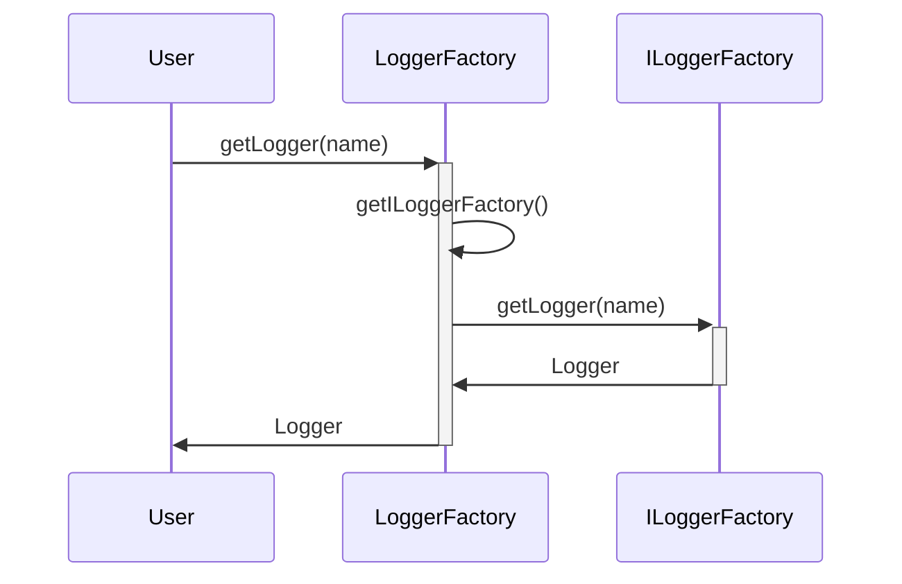

<!-- toc -->

## 1 背景知识

目前最流行的Java日志框架包括logback、log4j、log4j2，它们全都基于SLF4J这套API进行开发。SLF4J全称为Simple Logging Facade for Java，是为了给Java日志访问提供一个API框架。

绝大多数情况下，Java项目只需要在resources目录下准备好日志框架配置文件，并在代码中调用SLF4J相关的API即可实现日志功能。本文主要探究SLF4J及不同日志框架实现，在初始加载过程中的逻辑。

## 2 SLF4J加载流程

### 2.1 SLF4J使用方式

在使用过程中，用户往往只会接触到SLF4J的两个概念，一个是Logger，一个是LoggerFactory。大部分项目中通常可见如下方式进行日志初始化及输出的代码：

```java
Logger logger = LoggerFactory.getLogger(Test.class);
logger.info("hello");
```

Logger是一套API，是整个SLF4J-API体系下的一个主要用户入口，其约定了Logger需要提供按照不同日志级别将需要记录的对象进行记录的实现。

```java
public interface Logger {
  String getName();
  void debug(...);
  void warn(...);
  .......
}
```

LoggerFactory是一个为不同日志框架实现来生产Logger的工具类。

```java
public final class LoggerFactory {
  public static Logger getLogger(String name) {
    ILoggerFactory iLoggerFactory = getILoggerFactory();
    return iLoggerFactory.getLogger(name);
  }
}
```

### 2.2 SLF4J核心概念

**ILoggerFactory**

在获取Logger的方法中又引入一个新的概念，ILoggerFactory：

```java
public interface ILoggerFactory {
  Logger getLogger(String name)
}
```

ILoggerFactory为日志框架需要实现的API，用来生产实际Logger实例。再回顾LoggerFactory.getLogger(String name)中的getILoggerFactory()方法的具体内容：

```java
public static ILoggerFactory getILoggerFactory() {
  // 没有进行过初始化则进行初始化
  if (INITIALIZATION_STATE == UNINITIALIZED) {
    synchronized (LoggerFactory.class) {
      if (INITIALIZATION_STATE == UNINITIALIZED) {
        INITIALIZATION_STATE = ONGOING_INITIALIZATION;
        // 执行初始化
        performInitialization();
      }
    }
  }
  switch (INITIALIZATION_STATE) {
    case SUCCESSFUL_INITIALIZATION:
      // 出现一个新东西，StaticLoggerBinder
      return StaticLoggerBinder.getSingleton().getLoggerFactory();
    ......
  }
  throw new IllegalStateException("Unreachable code");
}
```

在这里，如果没有进行初始化则进行初始化；如果执行成功执行过初始化，则通过StaticLoggerBinder返回ILoggerFactory实例。这里继续介绍初始化逻辑，将会涉及到StaticLoggerBinder的具体介绍。

```java
private final static void performInitialization() {
  bind();
  if (INITIALIZATION_STATE == SUCCESSFUL_INITIALIZATION) {
    versionSanityCheck();
  }
}
```

初始化的逻辑很简单，即调用bind方法

```java
private final static void bind() {
  try {
    Set<URL> staticLoggerBinderPathSet = null;
    if (!isAndroid()) {
      // 查找包里面所有的 org/slf4j/impl/StaticLoggerBinder.class
      staticLoggerBinderPathSet = findPossibleStaticLoggerBinderPathSet();
      // 如果找到了多个说明引用了多个日志框架，这里会打日志
      reportMultipleBindingAmbiguity(staticLoggerBinderPathSet);
    }
    // the next line does the binding
    // 这里才会触发StaticLoggerBinder的初始化
    // 如果之前找到了多个StaticLoggerBinder类，那这里可以认为是随缘加载哪个，不可控
    StaticLoggerBinder.getSingleton();
    INITIALIZATION_STATE = SUCCESSFUL_INITIALIZATION;
    // 这里打日志实际加载了哪个
    reportActualBinding(staticLoggerBinderPathSet);
    // 附上Java doc解释吧：It used as a temporary substitute for the real ILoggerFactory during its auto-configuration which may re-enter LoggerFactory to obtain logger instances.
    fixSubstituteLoggers();
    // 重放SubstituteLoggerFactory里面记录的event
    replayEvents();
    // release all resources in SUBST_FACTORY
    SUBST_FACTORY.clear();
  } catch (NoClassDefFoundError ncde) {
   ......
  } catch (java.lang.NoSuchMethodError nsme) {
    ......
  } catch (Exception e) {
    ......
  }
}
```

在执行到这段代码之前，StaticLoggerBinder其实是没有加载的。这里通过调用StaticLoggerBinder.getSingleton()的单例方法，来实现具体日志框架的初始化。

**StaticLoggerBinder**

org.slf4j.impl.StaticLoggerBinder等效于SPI，下面是SLF4J中的默认实现（不会打包）。每个日志框架中必须按照这个全限定类名实现自己的StaticLoggerBinder类，并包括以下方法和属性。

```java
public class StaticLoggerBinder {
    private static final StaticLoggerBinder SINGLETON = new StaticLoggerBinder();

    public static final StaticLoggerBinder getSingleton() {
        return SINGLETON;
    }
  
    public static String REQUESTED_API_VERSION = "1.6.99";

    private StaticLoggerBinder() {
        throw new UnsupportedOperationException("This code should have never made it into slf4j-api.jar");
    }

    public ILoggerFactory getLoggerFactory() {
        throw new UnsupportedOperationException("This code should never make it into slf4j-api.jar");
    }

    public String getLoggerFactoryClassStr() {
        throw new UnsupportedOperationException("This code should never make it into slf4j-api.jar");
    }
}
```

可见，具体的ILoggerFactory也由具体的StaticLoggerBinder进行返回，每个日志框架自己的初始化逻辑均由自己实现的StaticLoggerBinder发起。

### 2.3 SLF4J加载流程总结

现在对上文涉及到的流程进行一个汇总

**获取Logger流程**



**首次加载流程**

```mermaid
sequenceDiagram
	participant getILoggerFactory()
	participant performInitialization()
	participant bind()
	participant StaticLoggerBinder
	getILoggerFactory() ->>+ performInitialization(): 
	performInitialization() ->>+ bind(): 
	bind() ->>+ StaticLoggerBinder: getSingleton()
	Note right of StaticLoggerBinder: 加载类<br/>执行静态代码块<br/>执行getSingleton()
	StaticLoggerBinder ->>- bind(): StaticLoggerBinder
	bind() ->>- performInitialization(): 
	performInitialization() ->>- getILoggerFactory(): ;
```

到StaticLoggerBinder.init()的部分，就是各个日志框架自己的初始化的逻辑。下面将一一介绍三个主流日志框架的初始化流程。
