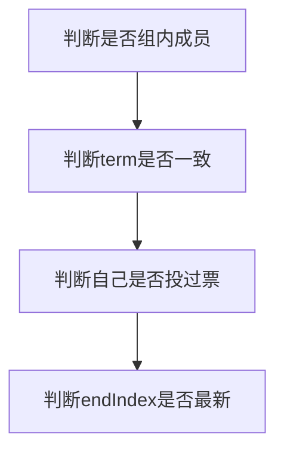
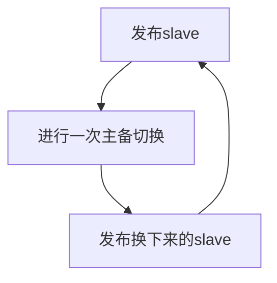

<!-- toc -->

# RocketMQ高可用篇-DLedger实践

## 1 RocketMQ的两种高可用方案

通常对高可用的定义是：减少系统不能提供服务的时间。针对MQ的业务场景，高可用在这里其实还有多一层含义，即数据完整性。

RocketMQ围绕高可用提供了两种解决方案：主备、DLedger。下面分别进行介绍

### 1.1 主备方式

RocketMQ的主备很简单类似于MySQL，有以下特点：

- Master提供消息读写服务，Slave可以提供读服务
- Master/Slave之间不能自动切换、不能热切换

同时在数据完整性与效率的权衡上提供了一个参数供调整：

- SYNC_MASTER：全同步方式。Master收到的所有消息只会同步到Slave之后，才返回给客户端成功
- ASYNC_MASTER：异步同步方式。Master收到的所有消息异步同步给Slave

### 1.2 DLedger方式

DLedger方式为RocketMQ提供的一个扩展点，通过引入openmessaging-storage-dledger作为存储组件实现CommitLog的存储。DLedger基于Raft协议实现，满足了多节点数据同步的分布式一致性需求。

简单总结相比主备的新增特点：

- RocketMQ针对DLedger场景做了改造，支持Master/Slave自动切换、热切换
- 半同步方式：消息在多数节点（含自己）同步之后，即返回客户端成功

### 1.3 对比

| 方案       | 数据完整性     | 主备切换       |
| ---------- | -------------- | -------------- |
| 主备-SYNC  | 数据100%不丢失 | 手动，需重启   |
| 主备-ASYNC | 数据可能丢失   | 手动，需重启   |
| DLedger    | 数据100%不丢失 | 自动，无需重启 |

主备的方式网上资料很多，不再做介绍， 下面主要介绍关于DLedger的方案及实现

## 2 DLedger设计

Raft协议在此不做介绍，可自行检索。补充几个基础概念以避免影响阅读：

leader：角色之一，即master

follower：角色之一，即slave

candidate：角色之一，候选人

term：任期，可理解为当前Leader是第几届

index：索引（位点），分为endIndex（最新的位点），startIndex（最老的位点）

quorum：法定人数，即集群半数以上

### 2.1 Leader选举

DLedger集群中各节点对于整个集群的节点数是已知的，并不存在注册机制，此处由几个参数决定

```java
// dledger组名，用于识别
String group = "default";
// selfId，即组内自己的标示
String selfId = "n0";
// peers，包括组内全部节点，及各自的ip、port
String peers = "n0-172.168.1.1:20911;n1:172.168.1.2:20911;n2-172.168.1.3:20911"
```


Leader与Follower之间存在心跳，同时均各自维持着集群当前term。当心跳消失一定时间后，follower则自行变更角色为candidate发起投票。此处包含两个主要参数

```java
// 心跳间隔
int heartBeatTimeIntervalMs = 2000;
// 多少次心跳间隔后仍未收到，则成为candidate
int maxHeartBeatLeak = 3;
```

发起投票的过程为candidate向group内所有节点发起投票请求（包括自己投自己），当收到的赞成票达到quorum时，则变更角色为leader。各follower处理投票请求的逻辑主要为



当角色变更为leader后，会对所有组内所有成员进行心跳广播，收到心跳的follower及candidate会更新状态保存当前集群的leader，同时确保自己角色变更为follower。

在角色变更为Leader的同时，RocketMQ针对变更事件注册了Hook，执行Slave到Master的热切换。

### 2.2 CommitLog同步

#### 2.2.1 数据追加

RocketMQ有两种CommigLog，一种普通的，类名就是CommitLog，另一个是DLedgerCommitLog，专为DLedger准备。

主要的区别在于putMessage方法，在CommitLog中主要为：

- 本地IO：MappedByteBuffer
- 同步Slave：根据同步模式的配置不同，会阻塞/不阻塞

而在DLedgerCommitLog中，Dledger对一些逻辑进行了封装，但大体逻辑基本一致：

- 本地IO：MappedByteBuffer
- 等待quorum返回ACK

DLedger对数据进行封装，每一个单元为一个Entry，连续存在一个数据文件中，同时有一个专属的索引文件。当leader完成本地写入内存后，后台线程会扫描当前数据文件的进展，按entry将数据推送到follower，同时记录follower返回过ack的最新位点。当quorum的位点超过某个值offsetN之后，则等待offsetN ACK的线程会停止阻塞继续执行，即master会继续执行这个消息发送请求后面的部分，直到返回。

#### 2.2.2 数据对比

当有新节点加入集群后，会进行数据对比，以确定新节点的数据位点，从此位点开始继续。如果新节点的位点大于leader，则会将其重置。

## 3 DLedger实践

DLedger作为一个年轻的项目，坑还是不少的，实践既是解坑

实践配置介绍：

- CPU：24核
- 内存：128GB
- 硬盘：SSD，RAID-0，无缓存
- 网卡：双千兆网卡，bond4，layer3+4
- OS：内核4.9.4
- 文件系统：ext4

### 3.1 关于配置

DLedger自身配置中值得注意的包括两点：

- peers：组内各节点的信息
- peerPushQuota：leader往follower推送数据的限额

**peers**

DLedger集群目前是没有动态修改集群配置的功能的，而动态增减节点又是一个非常频繁的需求。这里想到了在peers中配置域名的方案。

**peerPushQuota**

由于DLedger集群至少是3节点起步（才能在宕机1台后存在法定多数并继续提供服务），多了一个节点需要同步数据，与原有主备方案相比更吃带宽资源。

这个值设置的是leader往follower推送数据的限额，在达到限额后会暂停推送，sleep到下一秒再继续。当限额耗尽，就会导致等待quorum ACK耗时较长的问题。所以该配置需要根据机器网卡性能进行合理配置。这里提供一个参考

```
消费_生产比：由于topic可由多个消费者订阅，则消费产生的出口流量大于生产产生的入口流量，这里出口/入口的流量币即为该值

入口流量上限 = 单网卡带宽上限 * 网卡数量 / (节点数量 + 消费_生产比 + 1)
peerPushQuota = 入口流量上限
以双千兆网卡，3节点，消费生产比2:1为例核算，peerPushQuota推荐为50MB(400Mbps)
```

### 3.2 关于性能

由于需要达到quorum ACK，DLedger性能与不需要ACK的ASYNC_MASTER对比是有下降的。在低延时网络下实测下降不多，大约10%左右。

但是！在RT上存在毛刺，主要表现为频繁出现投递耗时超过250ms的情况，导致broker busy异常影响消息投递：

- 内存操作耗时毛刺排查及解决方案[RocketMQ DLedger毛刺排查](https://www.yuque.com/chentairan-klqff/wnx49g/gggt00)
- ACK毛刺耗时排查及解决方案：已解决，这里的原因为GC+配置参数综合的一个体现。文档TODO。。。

### 3.3 关于运维

常见的运维场景主要为发布、扩缩容

**发布**

对slave进行发布对于MQ用户来说是完全无影响的，那么发布流程可以设计为



由于多集群部署以及客户端默认重试机制的存在，进行主备切换对于未指定MessageQueue的投递是无感知的，失败默认会重试到别的master。但指定MQ的投递可能会因为主备切换而中断一瞬间，根据使用场景，可以在MQclient或用户代码处进行容灾并自动重试。

**主备切换**

刚才提到发布过程需要使用到主备切换，DLedger提供了运维命令可以进行主备切换，对master执行，将其角色切到指定节点。这里会进行一系列校验，其中最主要的是校验目标节点的数据落后情况。当数据落后超过阈值时切换将会被拒绝。

**扩容**

与主备方式的mq没有区别，准备一个集群的新机器，复制topic上去，再部署应用启动即可

**缩容**

与主备方式的mq没有区别，关闭Broker写后，直到没有读流量，关闭读，观察无异常后停止应用下线即可

### 3.4 关于功能与BUG

**批量消息不支持**

DLedgerCommitLog中没有实现putMessages，所以是不支持批量消息的。关于这点已经实现并提交了[PR](https://github.com/openmessaging/openmessaging-storage-dledger/pull/67)，但目前正式版4.7.1是没有的。

**peers域名解析错误**

带中横线的域名当前dledger的0.1正式版是不支持的，[修复](https://github.com/openmessaging/openmessaging-storage-dledger/pull/69)已合并。

**日志同步的Bug**

该[问题](https://github.com/apache/rocketmq/issues/1778)存在于DLedger0.1正式版中，[修复](https://github.com/openmessaging/openmessaging-storage-dledger/pull/50)已合并。

**leader选举的Bug**

该[问题](https://github.com/openmessaging/openmessaging-storage-dledger/issues/52)存在于DLedger0.1正式版中，[修复](https://github.com/openmessaging/openmessaging-storage-dledger/pull/53)已合并。

## 4 总结及展望

DLedger作为存储组件，是不算太复杂的一个项目。其提供了较原始主备方案更快的切换效率以及基础的故障识别功能，对于MQ可用性的提升是显而易见的。同时，从原方案到DLedger升级路径也算比较清晰、简单。

由于业界使用较少，目前未发现的坑还是不少，并且一些在MQ上已经应用的优化并没有支持过来，能用但过待完善的地方还是不少，这里列举一些个人的后续期待：

- 健康检查：目前是通过心跳的模式比较单一，不能识别诸如磁盘只读之类的异常，会导致一些特定异常无法感知并切换主备。这里需要提供一些扩展性。
- 性能与文件系统：考虑对MappedFile提前进行预热，或测试在xfs下的表现
