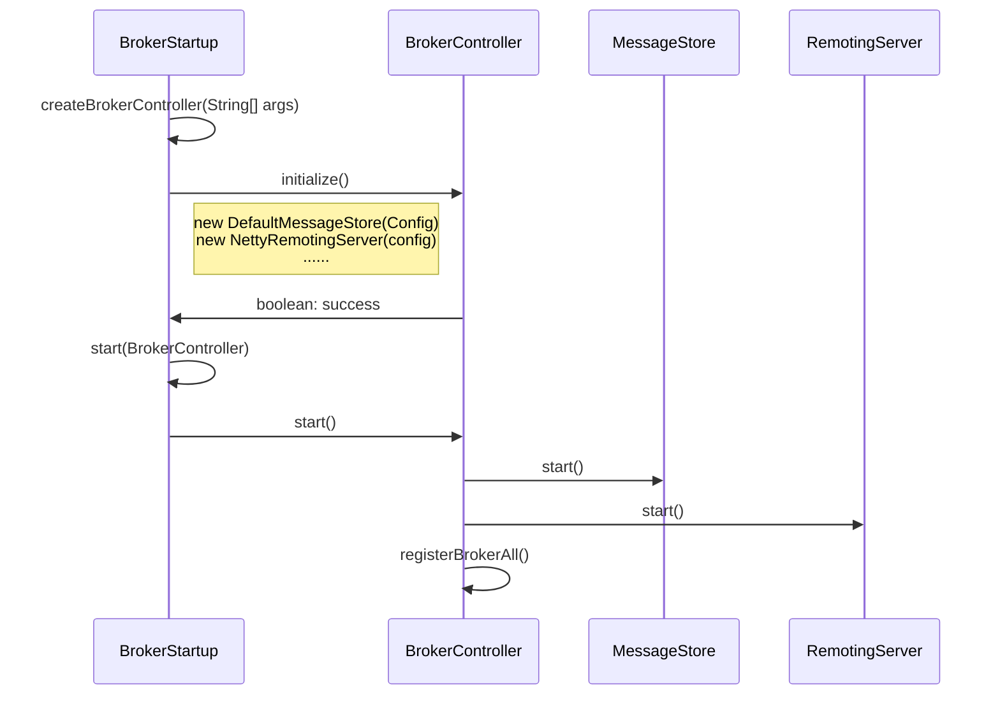
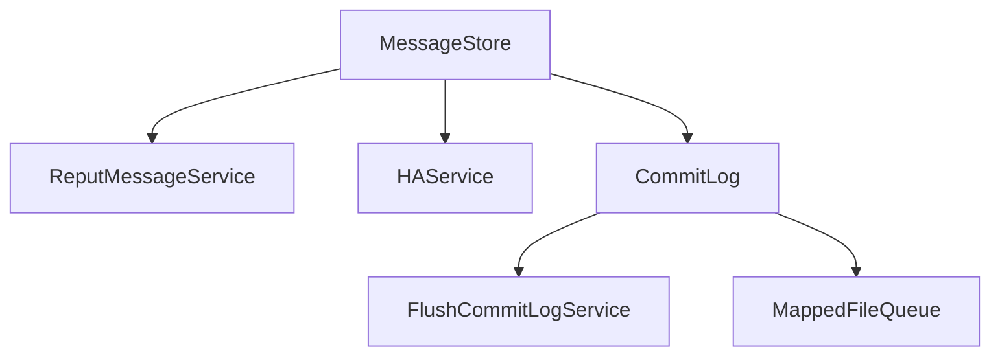
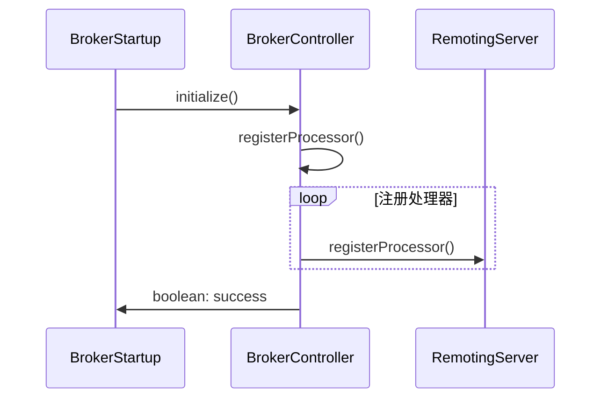
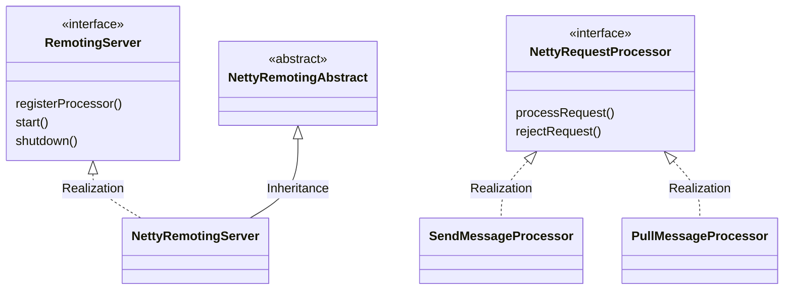
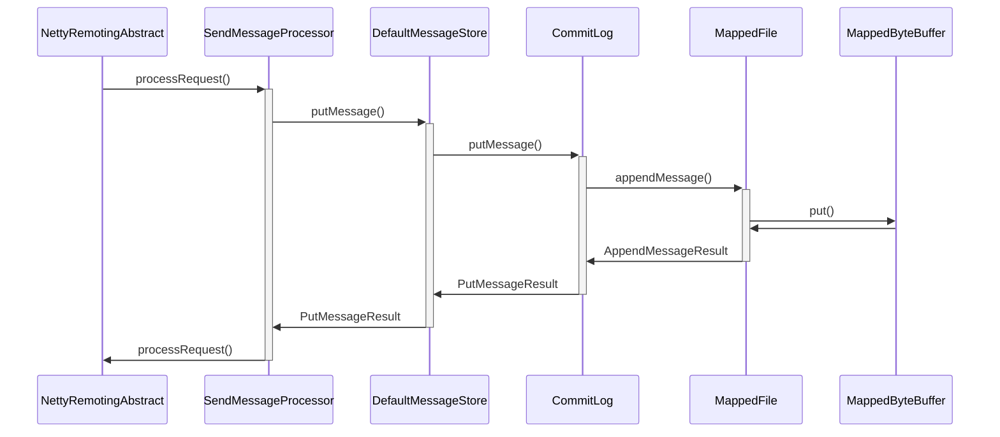
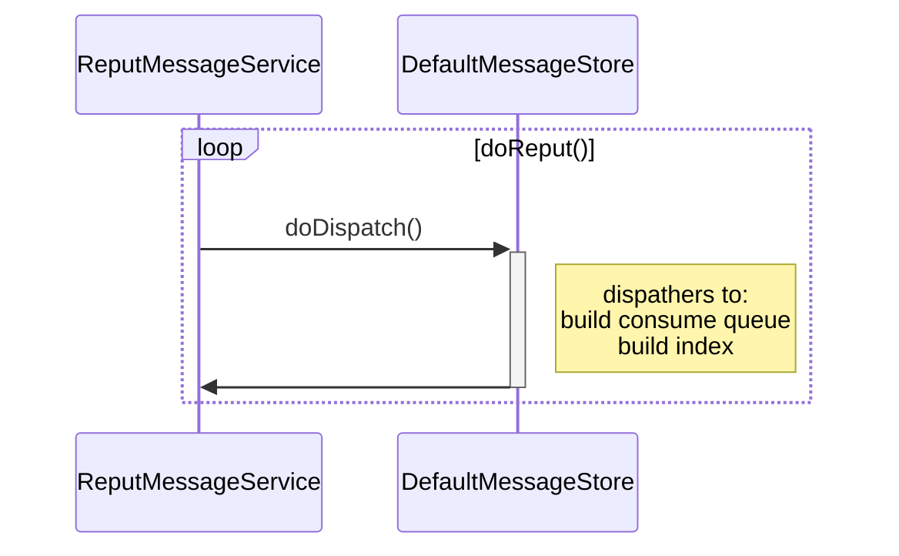
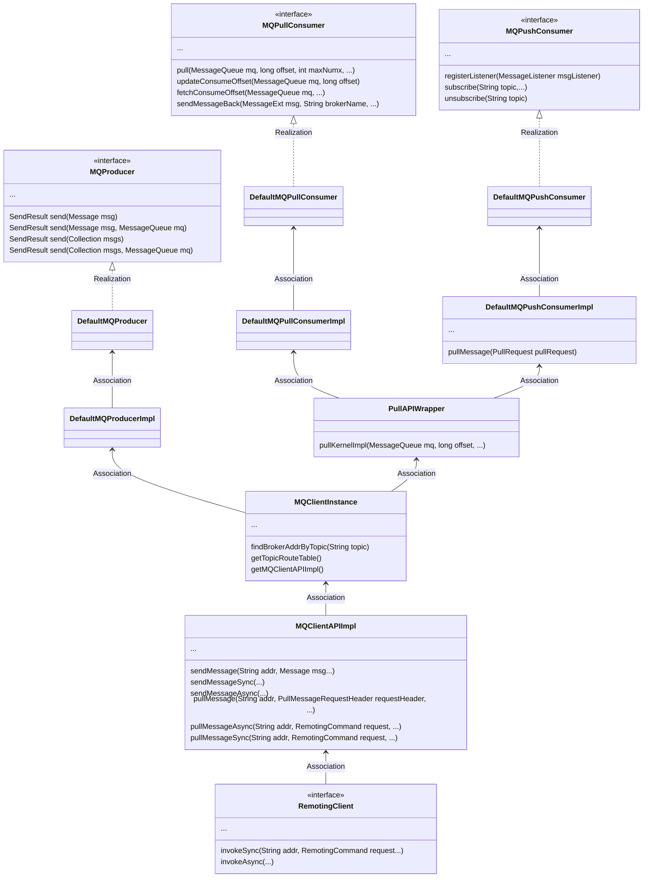
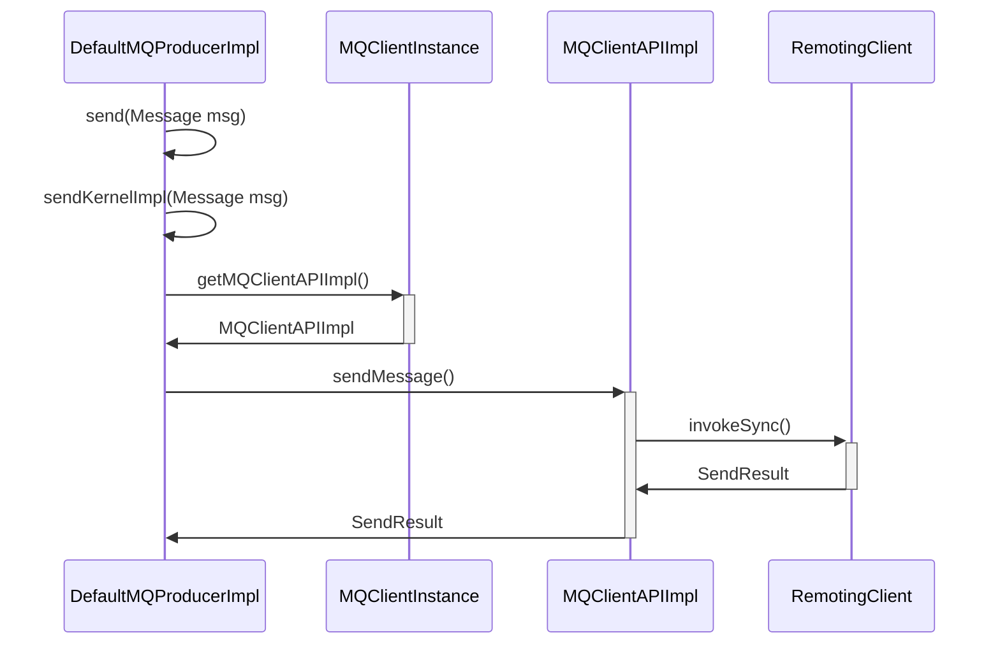
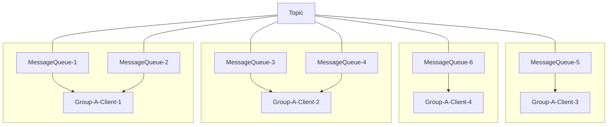

# RocketMQ-架构篇

<!-- toc -->

## 1、Broker

Broker是RocketMQ的服务端组件之一，所有消息存储在Broker上，所有的投递、消费请求也都由Broker进行处理。Broker是有状态的应用，本地存储了消息、索引、消费位点等信息，不同的Broker具有不同的角色。

下面简单介绍Broker的主要结构及功能

### 1.1、从启动感知架构

#### 1.1.1、核心组件

BrokerStartup#main为broker启动入口


- BrokerController为broker控制器，管理broker所有顶层对象的生命周期
- MessageStore为存储服务，默认实现为DefaultMessageStore
- RemotingServer为网络服务，默认实现为NettyRemotingServer
- createBrokerController(String[])中，我们根据配置初始化四个核心配置文件，并使用配置文件创建BrokerController对象
  - BrokerConfig: broker基础配置，主要包括集群属性、文件路径、功能开关、性能参数等
  - NettyServerConfig：broker服务端配置，服务端主要用于接收请求
  - NettyClientConfig：broker客户端配置，主要用于发送请求（to nameServer/client）
  - MessageStoreConfig：存储服务参数配置
- BrokerController同时还控制其他顶层对象初始化，这里不一一介绍


#### 1.1.2、存储组件

存储基于本地文件存储



- CommitLog：数据文件对象，主要的属性包括：
  - FlushCommitLogService：刷盘服务，主要为定时模式
  - MappedFileQueue：具体的文件列表，文件为MMap对象，直接对接操作系统
  - MMap文件：单个文件固定1G大小，所有消息不区分主题等属性，在文件中连续存放
- ReputMessageService：消费CommitLog，将消息按topic等纬度，生成不同的索引文件，便于消费
- HAService：主从同步服务

#### 1.1.3、网络组件

网络基于Netty实现



启动时，在BrokerController在创建RemotingServer之后，会将所有Processor注册



主要的Processor包括：

- SendMessageProcessor：处理投递时发送、重试消息等请求
- PullMessageProcessor：处理消费时拉取消息等请求

### 1.2、消息投递

#### 1.2.1、处理发送请求

以下述场景为例：

- Broker角色：master
- 消息类型：普通消息
- 消息数量：单条
- Broker配置：ASYNC_FLUSH ASYNC_MASTER



- RemotingServer收到请求后，根据RemoteCommand，将请求分发给对应的Processor，这里由SendMessageProcessor处理投递消息的请求
- SendMessageProcessor对Broker状态及消息进行必要的验证后，将请求重新包装为MessageExtBrokerInner，交给DefaultMessageStore继续处理
- DefaultMessageStore同样对Broker状态及消息进行部分信息的验证后，交给CommitLog处理
- CommitLog获取到目前最新的MappedFile，交给MappedFile进行写入
- MappedFile将消息格式化、序列化后，写入MappedFile具体文件对应的MappedByteBuffer中

至此，一次发送请求处理完毕，消息生产者将会收到答复，然而Broker端的处理工作并没有结束

#### 1.2.2、Flush与HA

CommitLog的putMessage()方法中，当操作MappedFile写入完毕之后，会调用handleDiskFlush()、handleHA()。在上述的异步配置Broker中，这两个方法并不会导致阻塞，请求得以直接返回。

在异步刷盘的情况下，Flush服务的实现类为FlushRealTimeService，通常会在每500ms触发一次强制flush

```java
class FlushRealTimeService extends FlushCommitLogService {

        public void run() {
          ......
            while (!this.isStopped()) {
              ......
                try {
                  // false
                    if (flushCommitLogTimed) {
                        Thread.sleep(interval);
                    } else {
                      // default 500ms
                        this.waitForRunning(interval);
                    }
                    CommitLog.this.mappedFileQueue.flush(flushPhysicQueueLeastPages);
                } catch (Throwable e) {
                  ......
                }
            }
          ......
        }
```

在异步主备的情况下，slave与master建立HA链接，定期心跳自身位点，请求数据

#### 1.2.3、建立索引

在处理消息投递的流程中，收到的所有消息顺序存储在连续文件中，若需消费，则需要建立对应的索引。Broker在消息写入CommitLog后，会有ReputMessageService对写入commitLog的消息进行重新消费，以根据topic+queueId，构建索引文件(ConsumerQueue)



ReputMessageService是DefaultMessaeStore的一个内部类，定时执行doReput()方法，将最近的消息交给DefaultMessageStore中记录的dispatcher执行，包括：

- CommitLogDispatcherBuildConsumeeQueue：构建consume queue文件
- CommitLogDispatcherBuildIndex：构建index文件

#### 1.2.4、CommitLog ConsumeQueue Index

从前面的的流程中可以得知，Broker端接收一条投递的消息至少产生了三个文件，他们分别的含义及用途为：

- CommitLog：存储消息体本身
- ConsumeQueue：根据Topic-Queue，构建消息在CommitLog中的索引
- Index：根据消息在CommitLog中的位点，构建消息在CommitLog中的索引

### 1.3、消息消费

这里主要介绍Broker端在处理消费请求时的逻辑。

对于Broker端，所有消息消费的请求都是相同的，下面是拉取消息请求头的内容：

```java
public class PullMessageRequestHeader implements CommandCustomHeader {
    private String consumerGroup;
    private String topic;
    private Integer queueId;
    private Long queueOffset;
    private Integer maxMsgNums;
    // 标记，主要与事务消息相关
    private Integer sysFlag;
    private Long commitOffset;
    // 轮询时间
    private Long suspendTimeoutMillis;
  	// 过滤条件
    private String subscription;
  	// 订阅信息版本
    private Long subVersion;
  	// subscription类型
    private String expressionType;
}
```

较为常见的集群模式的消费请求处理的过程如下：

- 检查信息
  - Broker状态：是否可读
  - 订阅组组信息：是否存在、是否启用
  - 主题信息：是否存在、是否可读、请求的队列是否存在
  - 消费组信息：消费组是否存在、消费组下的订阅组是否存在、订阅组的版本是否最新
  - 其他非核心路径的检查......
- 查询消息
  - 根据queueOffset从ConsumeQueue中查询到对应CommitLog的位点及大小
  - 根据CommitLog的位点及大小从CommitLog中查询到对应数据
- 更新统计数据
- 返回

## 2、NameServer

NameServer是RocketMQ的服务端组件之一，为MQ集群提供协调功能，记录并监控所有Broker、Topic信息。NameServer是无状态的应用。

### 2.1、结构

NameServer结构和Broker类似，同样是Startup->Controller的启动结构，几个核心组件如下：

- NameSrvController
  - RouteInfoManager：namesrv上所有数据的管理，包括topic、broker等
  - BrokerHousekeepingService：broker下线（或异常）时的处理

上述功能基本比较简单，不涉及持久化、同步等概念，仅有一个DefaultRequestProcessor负责具体请求的处理。下面简单介绍其主要功能

### 2.2、注册与更新

在Broker与NameServer间会维持一个长链接，Broker定期向NameServer进行注册（心跳），注册的信息包括

- Broker集群信息：ClusterName、BrokerName、BrokerId
- BrokerIp
- Topic信息

这些信息的心跳会使得NameServer上的RouteInfoManager随之更新。RouteInfoManager的主要属性包括：

```java
HashMap<String/* topic */, List<QueueData>> topicQueueTable;
HashMap<String/* brokerName */, BrokerData> brokerAddrTable;
HashMap<String/* clusterName */, Set<String/* brokerName */>> clusterAddrTable;
HashMap<String/* brokerAddr */, BrokerLiveInfo> brokerLiveTable;
```

每隔10s，NameServer会检查BrokerLiveTable。如果存在超过120s没有收到更新，会认为Broker已失效，将其信息移除。长链接断开也会触发该逻辑。

### 2.3、路由

RocketMQ的路由更新为非实时，客户端会定期从NameServer更新需要的路由信息。

## 3、Client

Client时RocketMQ的客户端，负责消息的生产、消费。下面简单介绍客户端主要的发送及消费逻辑

### 3.1、结构



如图，默认情况下，客户端中所有Producer、Consumer共用一个MQClientInstance，可以通过设置instanceName来确保使用不同的MQClientInstance实例。

Producer只有一种实现，可以实现发送单条、批量消息，可以指定队列发送。

Consumer有两种实现，pull及push模式，但内在均通过PullAPIWrapper拉取消息，push模式为pull模式的一种封装。

### 3.2、发送

下面简单介绍发送消息的流程

#### 3.1.1、通用流程

以发送单条消息、不指定队列为例



DefaultMQProducerImpl主要负责业务层面的处理。在最初调用DefaultMQProducerImpl时，我们只需要提供参数msg，DefaultMQProducerImpl中会查询topic的路由，会按照轮询机制返回本次投递的目标队列（MessageQueue）。之后DefaultMQProducerImpl会根据队列查询队列所在Broker的ip，同时将本次投递的内容中的信息整合生成RequestHeader。上述信息作为参数由DefaultMQProducerImpl调用MQClientAPIImpl的sendMessage()方法时一并传递。

MQClientAPIImpl主要负责对接网络层与业务层，有它调用netty客户端发送请求。

#### 3.1.2、批量消息

批量消息的发送接口相对上面介绍的单条消息，仅仅将入参由`Msssage`替换为了`Collection<Message>`。在发送过程中，`Collection<Message>`被封装为`Message`，其余流程没有变化。

#### 3.1.3、指定队列消息

指定队列消息的发送接口在参数中增加了`MessageQueue`，这使得DefaultMQProducerImpl不再需要选择队列投递，其余逻辑基本一致。

值得注意的是，未指定队列的消息在失败后将自动更换队列重试三次，而指定队列消息在失败后并不会重试，所有异常将有发送的调用方进行处理。

### 3.2、消费

在前面的结构分析中可以看到，消费相关的类有两种，分别是pull和push模式，下面分别介绍两种模式的特点

#### 3.2.1、Pull模式

回到上面MQPullConsumer的接口列表中，可以看到pull模式的消费非常比较直接：提供MessageQueue及offset，直接尝试获取对应位点的消息。

首先需要介绍典型的Topic的消费模型：



- 一个topic可能有多个MessageQueue
- 一个MessageQueue通常只被一个客户端消费
- 一个客户端通常可以消费多个MessageQueue

可以看出，pull模式消费这里涉及到两个需要考虑的问题：

- 分布式多客户端条件下，如何协调客户端与MessageQueue的对应关系
- 位点管理：存储在本地、或是服务端（Broker），这里同样涉及客户端到MessageQueue的协调问题

在pull模式下，这些问题都需要调用方自己去解决。同时RocketMQ也提供了push的消费模式作为补充，可以算是对pull模式在可用性上的一个优化。

#### 3.2.2、Push模式

Push模式可以简单的理解为一个订阅-发布模式：Client向Broker订阅Topic下的消息，调用方在Client中注册一个Listerner，在消息到达时调用Listener进行处理。在这种情境下，Broker知道一共有哪些Client。顺理成章地，Client在RocketMQ的体系下能够感知当前一共有多少Client，再结合Topic所拥有的MessageQueue数量，按照同一的逻辑，这里就可以对Client-MessageQueue进行分配（负载均衡），这即是push模式对pull模式下第一个问题提供的解决方案。

```
负载均衡有五种默认策略提供，分别是：
AllocateMessageQueueAveragely：平均分配
AllocateMessageQueueAveragelyByCircle：平均轮询分配
AllocateMessageQueueConsistentHash：一致性哈希
AllocateMessageQueueByConfig：自定义配置
AllocateMessageQueueByMachineRoom：根据机房
```

接下来是位点管理。Push模式还分为两种：集群模式与广播模式。这为pull模式的第二个问题提供了解决方案

- 集群模式：所有消息只被最多一个客户端消费。位点以消费组为纬度，在broker上存储
- 广播模式：所有消息被每个客户端消费。位点以消费组为纬度，在本地存储

同时还需要注意，前面有提到push模式为pull模式的一种封装，内在仍为pull的模式。这意味着并不是Broker每到一条新消息就会推送给Client，而是Client通过轮询的方式不停从Broker进行查询。在消费速度大于生产速度，不存在堆积的时候，消息近似于到达Broker即被Client端拿走；而当消费速度小于生产速度时，本地会有缓存队列缓存即将消费的一段消息，提升消费速度。

## 4、FilterServer

FilterServer是RocketMQ的服务端组件之一，主要用于消息过滤，目前还没有一定需要使用的场景。

通常我们有更简单的使用tag的方式来完成消费消息的过滤，FilterServer则是通过运行上传的代码对消息进行过滤。

