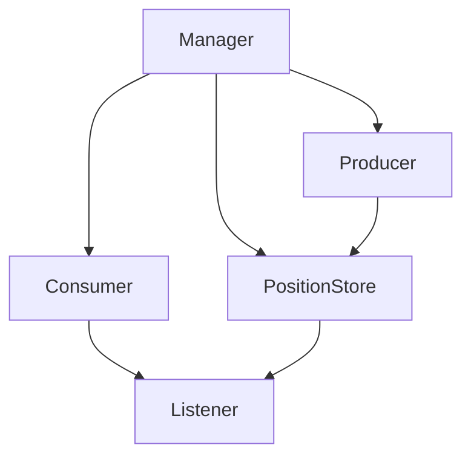

<!-- toc -->

----最近尝试思考一种场景该套用哪种设计模式时陷入一个误区，最终反省过来：现成的设计模式只是以往领域设计范畴成功案例的总结，当你发现现有设计模式套进来总是不完美的时候，不要怀疑自己，那的确是已有的设计模式在这个领域场景下不适用。最终只要产出的模型符合领域驱动设计及设计原则，它就是妥当的。

## 1 背景

思考的是一个这样的场景：读文件，经过一定数据处理步骤，投递到MQ。

显然，可以初步划分这样三个角色：

- 读文件模块
- 数据管道（根据需要挂上多个不同的数据处理组件做Intercept）
- 读数据管道模块，投递MQ

初步结论是：生产者/消费者，以及拦截器，这两个设计模式可以用在这里。

但这里还有个需求：投递成功的位点需要持久化。显然，生产者/消费者以及拦截器模式对这个需求并不能原生的包容进来。

问题来了，怎么样的回调方式更符合妥当？问题在团队中引发了一些讨论，下面是一些思考历程。

PS：本意是先不讨论是否过度设计，按照最优雅的方式来。

## 2 基本模型-生产者/数据管道/消费者

忽略拦截器部分的细节，这里先按照生产者/消费者/数据管道的模式给出一个初步的模型。

**产品**

```java
public interface Product {
}
```


**生产者**

```java
public interface Producer<E> {
	E product();
}

public abstract AbstractProducer<E> implements Producer {
	protected Pipeline pipeline
	public AbstractProducer(Pipeline p) {
		this.pipeline = p;
	}
  
  void process() {
    while(!shutdown) {
      this.pipeline.put(product());
    }
  }
} 

public class ProductProducer extends AbstractProducer<Product> {
  void commit(long offset) {
    ...
  }
  ...
}
```

**数据管道**

```java
public interface Pipeline<E> {
  boolean put(E e);
  E take();
}
```

**消费者**

```java
public interface Consumer<E> {
  void consume(E e);
}

public abstract AbstactConsumer<E> implements Consumer {
  protected Pipeline pipeline
	public AbstactConsumer(Pipeline p) {
		this.pipeline = p;
	}
  
  void process() {
    while(!shutdown) {
      consume(this.pipeline.take());
    }
  }
}

public class ProductConsumer extends AbstractConsumer<Product> {
  ...
}
```


## 3 初步设计-生硬的插入回调

首先想到三个角色之间，生产者、消费者肯定不能互相依赖。那么确认位点的操作肯定不能是由消费者直接调用。一拍脑袋想到一个解决方案，在product中加个回调，在consumer中主动调用

```java
public interface Product {
  Runnable getCallback();
}

public class ProductProducer ... {
  Product product() {
    Product product = new Product();
    ...
    return product.withCallback(() -> {commit(..)});
  }
}

public class ProductConsumer ... {
  void consume(Product product) {
    try {
      ...
    } finally {
      product.getCallback().run();
    }
  }
}
```

这里存在几个问题

- Product是数据，界限中是否应该有Callback？
- Consume是否应该主动调用Product的Callback？

**回到SOLID设计原则上来**，这两个疑问很好解答，这里在Product中放置Callback，违反了**单一职责原则**，后果就是这样的设计难以理解，并不会有人注意到Product中存在一个callback接口，后面维护的同学在增加新的Consumer的时候很可能需要花上额外的注意力才能发现这个隐患。

下面尝试讨论中团队同学提出的另一种设计思路

## 4 Listener

从Producer中抽出位点管理模块，通过更上层的管理模块，将位点的确认操作在Consumer模块中注册为一个调用完毕后的Listerner。这里引入多项变更:

- Consumer增加consume完毕后的回调过程
- 上层模块增加对Consumer注册listener的过程
- Producer的实现中增加对位点模块的引用，主要在任务冷启动初始化部分使用

```java
public interface Consumer {
  void registeListerner(...);
}
public interface PositionStore {
  void save(...);
}
public class Manager {

  void newProductLine() {
    Pipeline pipeline = PipelineFactory.newPipeline;
    Producer producer = ProducerFactory.getProducer(pipeline, positionStore);
    Consumer consumer = ConsumerFactory.getConsumer(pipeline);
    consumer.registerListener(PositionStore::save);
    ......
  }
}
```

整体架构如图




最初，个人觉得在Consumer里插入Listener很别扭：

- Producer、Consumer的名字可能要根据引入Listener而做一些调整，已经不再是单纯Producer/Consumer；
- 上层模块关注到了一些貌似不该关注的细节上。
- PositionStore在Manager层并不是通用的接口，而是特定的Producer场景才会需要这个东西。如果需要关心是否使用PositionStore的方法作为Listener，以及Listener注册给谁这个细节，显然是开发过程中另一层不必要的心智负担，并且也不满足面向接口编程的要求。

下面是继续从第三节的方向针对Product的一些改造尝试

## 5 Product?Future?Transaction

再次尝试理清我们面临的问题是啥，现在的模型是「生产者-数据管道-消费者」。尝试将模型退化为「生产者-消费者」：当只有两个角色「生产者/消费者」时，两者的边界是直接接触的，当面临需要同步处理状态的场景时，这里可以通过Future进行传递。

模型引入数据管道意味着什么呢：生产者与消费者并没有直接接触的边界了。如果仍然需要引入Future，这里的Future是数据管道插入时返回的，语义只能是代表数据管道的处理状态；而从数据管道取数据的消费者并没有义务对take到的数据做什么额外处理。

那么传递的Product是否有改进空间？这里其实是一个本机的异步场景，而需要同步的结果，最先联想到的应该是事务！

对传递的Product替换为事务：

```java
public interface Transaction<E> {
  E getContext();
  void commit();
  void rollback();
}
```

Producer是事务的发起者，生产包含数据的事务；Consumer是事务的终结者，处理事务并提交或回滚。

同时事务作为一个常用的概念，在设计中作为通用语言引入完全不会造成额外的认知障碍，是个非常不错的接口。

但同样，当使用Producer产出Transaction，并在Consumer中commit Transaction时，对于单纯的生产者消费者模型来说也很别扭。

## 6 反思

那么我们需要完全尊从一个纯粹的生产者消费者模型吗？到这里想到几点：

- 我们面对的是有界限的场景，它的可扩展性也是有界限的，如果希望再进一步提炼出通用模型，也许就真的走到过度设计的范畴了。
- 现有的设计模式成功的向所有人普及了一套基础的设计语言，让人们得以形成沟通的基础，但它们只是来源于经典设计的提炼。一味的希望靠拢现有的设计模式并不可取。
- 不同的场景会形成不同的领域对象及语言，只要符合事务本身的属性，符合设计原则，易于在团队内部达成理解上的一致，它就是妥当且易于传承的。

## 7 最终选择

考虑下未来可能的扩展性：

- Producer：读文件之外，中期内不会有别的需求
- Consumer：投递MQ，或投递某个应用，可能有场景不需要严格的确认机制

这样看来：

- 位点管理在Producer内部或外部并不影响扩展性，这里并没有扩展性需求
- Listener并不是Consumer必须，当然也可以通过空跑实现
- Transaction也并不是Consumer必须，当然也可以通过空跑实现

单纯对比Listener于Transaction实现的优劣：

- Listener：需要在上层模块或通过额外配置，来确认Listener「enable」「type」这样的细节

- Transaction：由Producer直接封装到数据中确认方式，从接口层面完全屏蔽了所有细节

个人觉得还是将回调与数据封装的形式更胜一筹。

## 8 后续（补充）

最终我两种都没用。。文章写了大半后，因为数据管道那里增加了一些容量控制/限速的功能，最终确认机制结合Pipe来做：Producer与Pipe交互、确认已消费数据位点；Consumer与Pipe交互、确认数据已消费；Pipe内部是一个有界阻塞队列结构，内部数据增加了一层Confirmable的封装（看这个名字应该懂了吧），及异步清理的逻辑。
